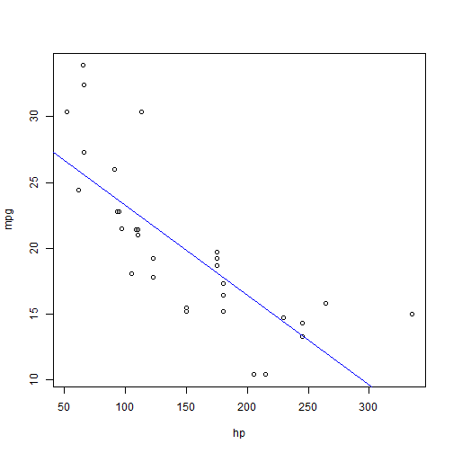

---
title       : Developing Data Products Assignment
subtitle    : 
author      : steven157
job         : 
framework   : io2012      # {io2012, html5slides, shower, dzslides, ...}
highlighter : highlight.js  # {highlight.js, prettify, highlight}
hitheme     : tomorrow      # 
widgets     : []            # {mathjax, quiz, bootstrap}
mode        : selfcontained # {standalone, draft}
knit        : slidify::knit2slides

--- {id: "Title"}

## Project Description
<br>
<br>
A simple Shiny application is constructed
<br>
and published to observe the relationship
<br>
between two factors of the mtcars
<br>
dataset from their plots.
<br>
<br>
<br>
In this application, the user
<br>
can choose the predicting variable
<br>
as well as observing variable to oberve
<br>
the pairs' relationship at their preference.


--- {id: "Second-slide"}

## Mtcars Dataset
<br>
The data was extracted from the 1974 Motor Trend US magazine,
<br>
and comprises fuel consumption and 10 aspects of automobile design
<br>
and performance for 32 automobiles (1973-74 models).
<br>
<br>
The mtcars dataset consists of 32 cars,
<br>
each recorded with 11 factors.

```
## [1] "Mtcars hp and mpg summary"
```

```
##    Min. 1st Qu.  Median    Mean 3rd Qu.    Max. 
##    52.0    96.5   123.0   146.7   180.0   335.0
```

```
##    Min. 1st Qu.  Median    Mean 3rd Qu.    Max. 
##   10.40   15.42   19.20   20.09   22.80   33.90
```

--- {id: "Third-slide"}

## How to use the application
<br>
<br>
1) User selects the predicting variable.
<br>
<br>
2) User selects the observing variable.
<br>
<br>
3) User selects their colour preference of the plot line.
<br>
<br>
4) Summaries of both predicting and oberving variables will be shown.
<br>
<br>
5) The plot generated for both variables and colours of the user preferences will also be shown.

--- {id: "Fourth-slide"}

## Sample Output

 
